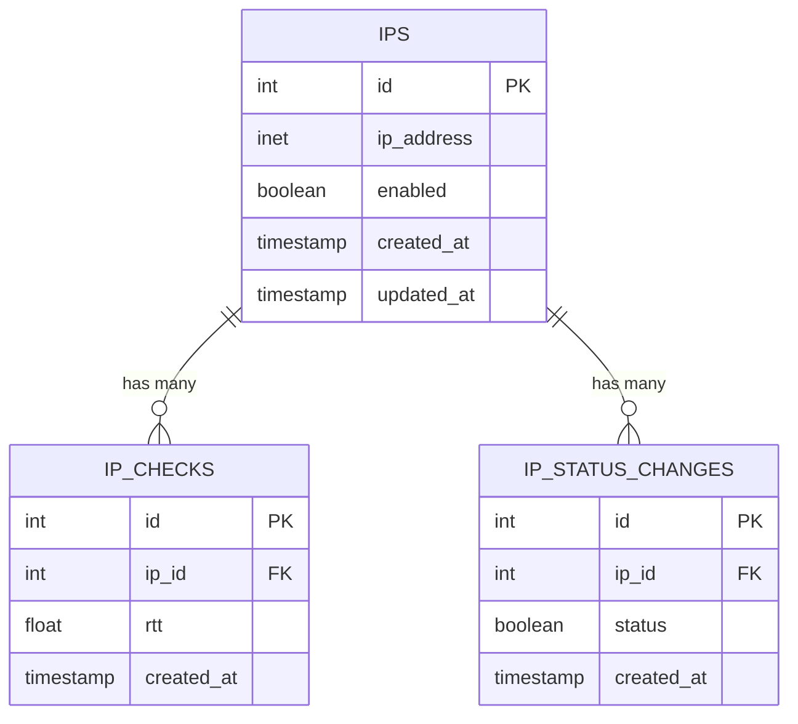

# IP Monitor

Проект для мониторинга IP-адресов.

## Описание

Проект представляет собой веб-приложение для мониторинга IP-адресов.
Он использует:
- Ruby 3.2.2
- Sinatra
- Sequel для работы с PostgreSQL
- Sidekiq для фоновых задач
- Redis для очередей
- RSpec (пока не реализовано)

## Структура базы данных



## Запуск

1. Клонируем репозиторий:
   ```sh
   git clone git@github.com:supronva-github/ip_monitor.git
   ```

2. Запускаем контейнеры:
   ```sh
   cd ip_monitor
   docker-compose up -d
   ```

## Базовая авторизация

Все запросы к API требуют базовой авторизации.
По умолчанию:
Username: `admin`
Password: `admin`

Пример использования с curl:
```sh
curl -u admin:admin http://localhost:9292/ips
```

## API

### GET /ips
Получить список всех IP-адресов.

**Пример запроса:**
```sh
curl -u admin:admin http://localhost:9292/ips
```

**Пример ответа:**
```json
[
  {
    "id": 1,
    "ip": "8.8.8.8",
    "enabled": true
  }
]
```

### GET /ips/:id/stats
Получить статистику по IP-адресу за указанный период.

**Параметры:**
- `time_from` (опционально): datetime в формате ISO8601 (например, 2025-04-15T10:00:00)
- `time_to` (опционально): datetime в формате ISO8601 (например, 2025-04-15T11:00:00)

Если параметры не переданы, возвращается статистика за последний час.

**Пример запроса:**
```sh
curl -u admin:admin "http://localhost:9292/ips/1/stats?time_from=2025-04-15T10:00:00&time_to=2025-04-15T11:00:00"
```

**Пример ответа:**
```json
{
  "avg_rtt": 10.5,
  "min_rtt": 5.0,
  "max_rtt": 15.0,
  "median_rtt": 10.0,
  "stddev_rtt": 2.5,
  "packet_loss": 0.0
}
```

### POST /ips/:id/enable
Включить сбор статистики для IP.

**Пример запроса:**
```sh
curl -u admin:admin -X POST http://localhost:9292/ips/1/enable
```

### POST /ips/:id/disable
Выключить сбор статистики для IP.

**Пример запроса:**
```sh
curl -u admin:admin -X POST http://localhost:9292/ips/1/disable
```

### POST /ips
Добавить новый IP-адрес.

**Пример запроса:**
```sh
curl -u admin:admin -X POST -H "Content-Type: application/json" -d '{"ip": "8.8.8.8", "enabled": true}' http://localhost:9292/ips
```

### DELETE /ips/:id
Удалить IP-адрес по ID.

**Пример запроса:**
```sh
curl -u admin:admin -X DELETE http://localhost:9292/ips/1
```

### GET /sidekiq
Доступ к веб-интерфейсу Sidekiq для мониторинга фоновых задач.

**Пример запроса:**
```sh
curl -u admin:admin http://localhost:9292/sidekiq
```

## Ограничения
Запрещены следующие диапазоны IP-адресов:
- `0.0.0.0/8`
- `127.0.0.0/8`
- `169.254.0.0/16`
- `224.0.0.0/4`
- `255.255.255.255`

PS: [IANA Number Resources](https://www.iana.org/numbers)

## Переменные окружения

- `DB_HOST`: хост базы данных (по умолчанию: localhost)
- `DB_PORT`: порт базы данных (по умолчанию: 5432)
- `DB_USER`: пользователь базы данных
- `DB_PASSWORD`: пароль базы данных
- `DB_NAME`: имя базы данных
- `REDIS_URL`: URL Redis (по умолчанию: redis://localhost:6379/0)
- `FORBIDDEN_IP_RANGES`: список запрещенных диапазонов IP-адресов

## Разработка

## Тестирование (пока не реализовано)

Проект использует RSpec для тестирования.
Запустить тесты:
```sh
bundle exec rspec
```

## Что улучшить еще:

- **Точность измерения ICMP**: использовать `CLOCK_MONOTONIC` вместо `Time.now` для более точных измерений.
  Подробнее: [Elapsed Time with Ruby the Right Way](https://blog.dnsimple.com/2018/03/elapsed-time-with-ruby-the-right-way/)

- **Кеширование для статистики**: добавить кеширование результатов статистики для улучшения производительности.

- **Поддержка IPv6**: доработать поддержку IPv6 для мониторинга.

- **Доменные имена**: добавить возможность мониторинга доменных имен.

- **Добавить дашборд с Grafana**: интегрировать Grafana для визуализации метрик и создания интерактивных дашбордов.
  Это позволит:
  - Отслеживать RTT в реальном времени
  - Создавать кастомные графики и алерты
  - Настраивать уведомления о проблемах
